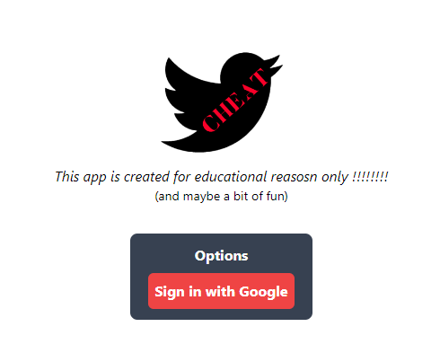

# Tartalomjegyzék {#tartalomjegyzék .TOC-Heading}

[Készítés oka [2](#készítés-oka)](#készítés-oka)

[Megvalósítás [3](#megvalósítás)](#megvalósítás)

[A website [4](#a-website)](#a-website)

[Vegyük a Feed nek a le bontását:
[7](#vegyük-a-feed-nek-a-le-bontását)](#vegyük-a-feed-nek-a-le-bontását)

[Az adatbázis [8](#az-adatbázis)](#az-adatbázis)

[Elérhetőség: [9](#elérhetőség)](#elérhetőség)

[Továbbfejlesztés [9](#továbbfejlesztés)](#továbbfejlesztés)

# Készítés oka

A cheat-tweet nevű alkalmazást azért készítettem, mert akartam egy saját
platformot, amin tudok képeket, videokat és fileokat megosztani a
barátaimmal, anélkül, hogy valami szabályozva legyen valami nagy cég
által. Az ötletet, hogy a Twitter alkalmazást válasszam, mint alap, az
akkor jött miután Elon Musk felvásárolta az alkalmazást és megosztotta
most már a tulajdonában levő Twitter alkalmazottak által eltitkolt,
megváltoztatott információt, a szabad beszéd eltörlését és meg sok mást.
Emiatt jött meg a kedvem arra, hogy készítsek egy sajátot, pontosabban
megpróbáljam lemásolni amennyire a legjobban lehet, de egy teljesen más
nyelvben, Frameworkban és adatbázissal, mint amik ok használnak. Neve
abból jött, hogy eleinte egy cheatsheet fele websitenak terveztem,
amiben az emberek a jegyzeteiket pustolhatják, a tanulásnak a
megkönnyebbítéséért, amiket mások is eltudnak olvasni.

# Megvalósítás

A webapp egy JavaScript Framework segítségével volt elkészítve.
[Nextjs](https://nextjs.org) egy továbbfejlesztése a Facebook által
készített [React](https://react.dev) Frameworknak. Azért választottam
ezt mert gyors és könnyű használni. Designnak egy a css nek
továbbfejlesztését használtam az scss([Sass](https://sass-lang.com))-t.
Ez könnyebbé teszi a design megírását, viszont azért, hogy mégyorsabb
legyen ezt csak a fő elemekre használtam a kisebb elemeket
[tailwindcss](https://tailwindcss.com) el desginoltam. A programozási
részen Nextjs úgy működik, hogy JavaScriptben irt html-t terít vissza
egy komponenskent, amit majd renderel egy fő html oldalon, ezt úgy, mint
dinamikusan, mint előre le generált html oldalként, ami elősegít a
betöltésben. A fájlokat .jsx nevezzük el, ezt csak azért, mert igy a
text editor (saját esetemben [VsCode](https://code.visualstudio.com))
könnyebben felismeri, hogy React file, és ezért az
[eslint](https://eslint.org) képes felismerni, ha a html code a
JavaScript fileban helyes szintaxissal rendelkezik. A fájlokat amikben
web programozás van, azért mert a JavaScript nem a legjobb a OOP ben,
ezért [Typescript](https://www.typescriptlang.org)(.tsx) et használok.

Az adatbázist a biztonság, a hosting, a stabilitás és nevelhetőség miatt
a Google által készített [firebase](https://firebase.google.com)-t
használok. Ez tökéletes, hiszen ha nem lep túl egy hatart használtságban
és file tarolásban a websiteom, akkor ingyenes. Valamint a bejelentésest
jelenleg Google-el oldottam meg, ami bele van építve firebasebe (a
biztonság miatt ez az egyik legjobb opció, amit ingyenesen kopható).

Az összes file tarolása az GitHub segítségével volt elérhető.

A hostolas az egy ingyen website hosting siterol történik
[Netlify](https://www.netlify.com)

# A website

A website angol nyelven van megírva, azért, mert ezt úgy terveztem, hogy
külföldiek is használni tudjak.

<https://cheat-tweet.netlify.app>

{width="6.75717738407699in"
height="3.3316633858267717in"}

A website teljes használatához be kell jelentkezni. Ez elérhető a bal
alsó sarokban vagy a Like vagy Comment gombra kattintva, hiszen azt csak
akkor lehet, ha valaki be van jelentkezve. A jelentkezest a Google gomra
kattintva a Google intézi. Amiket használunk a websiteon az a
felhasználó neve, e-mailje és profil kepe.

{width="3.2658891076115486in"
height="2.6193766404199477in"}

{width="6.255738188976378in"
height="3.0643766404199475in"}

Kijelentkezni a név melletti 3 pontra lehet.

Bejelentkezés után megjelenik a postolas lehetőség, Kötelező a szöveg,
és opcionális a kép, vagy file feltöltésé.

Saját post eseten törlés gomb is megjelenik.

{width="5.852411417322835in"
height="0.7207403762029746in"}

Comment gombra kattintva egy fel ugró ablak segítségével lehet szöveget
írni. Elküldés után ez átvisz az e postnak az oldalara. Ami a commentek
szamara kattintva is elérhető.

{width="3.5007567804024498in"
height="2.1308956692913386in"}{width="2.8966076115485566in"
height="2.4962631233595802in"}

{width="1.4098840769903762in"
height="4.041666666666667in"}Képek és filok eseten is rajuk kattintva
ezek megnyílnak egy másik ablakban, teljes felbontásban.

{width="2.75in"
height="4.015288713910762in"}{width="5.1875in"
height="3.027083333333333in"}A minket érdeklő filok itt láthatóak. Az
index.tsx file ban van összefoglalva. Az oldal 3 részből áll: Sidebar
(bal oldali oszlop), Feed (középső oszlop), RightSidebar (jobb oldali
oszlop). Erre rákerül a CommentModal, ami a felugro ablak, amibe a
commentünket írhatjuk.

## Vegyük a Feed nek a le bontását:

{width="3.1145833333333335in"
height="2.0520833333333335in"}{width="3.46875in"
height="4.823603455818023in"}

{width="0.8125in"
height="3.841666666666667in"}{width="2.3854166666666665in"
height="2.375in"}Az előző kicsi codereszlet egy querryt tartalmaz az
összes post lekérésére az adatbázisból, amiket egy arraybe rakunk bele.
Majd a html codeban a js map funkció segítségével feltoltjuk a Feed-et
postokkal, amihez készítettünk egy külön komponenst, aminek tovabbadjuk
maga a lekert post-nak az adatát.

{width="2.8895833333333334in"
height="2.6972222222222224in"}Ez egy nagyon nagy file hiszen ebben
történik a postnak a feltöltésé, a likolás, commentelés és mindegyik
felhasználó neve profilnak a kimutatása. Pld-nak itt van a profil kép
nek a feltöltése, és a likolas

{width="3.5770833333333334in"
height="1.4166666666666667in"}

# Az adatbázis

{width="4.572916666666667in"
height="3.2313320209973755in"}A következő code részlet az adatbázishoz
való csatlakozásért érvényes, biztonság kedvéért, mindennek van saját ID
je amivel képes egy Google API-on keresztül beszélgetni. Ennek meg
nagyobb biztonságára egy .env filet használok, ami nem kerül fel
GitHubra.

{width="5.444444444444445in"
height="3.0520833333333335in"}Firebase-en 2 fele tárolást használunk.
Firestore-t a szöveg, like, comment és a felhasználó adatainak a
tarolására(kis méretűek), és Storage-ot a képek és fileok tárolására.

{width="6.96875in"
height="3.953472222222222in"}

A tarolás a post ID szerint működik, ami random autó generált, ez
megegyezik a képeknél és a postoknál. Minden postnál ahol van kép van
egy img string konstans, ami egy linket tarol. Mikor a felhasználó
feltolt egy filet, akkor firebase generál egy Public linket, ezt
berakjuk oda.

# Elérhetőség:

A website-ot a:

<https://cheat-tweet.netlify.app> linken lehet elérni és használni.

A website teljes code ja megtalálható a:
<https://github.com/progenor/cheat_tweet> linken.

Amennyiben saját maga szeretne készíteni egy másolatot, esetleg egy
sajátot hostolni, az teljesen megengedett, ehez az szükséges, hogy kell
készítsen egy firebase accountot és egy új projektet, amiben hozzad egy
webapp projectet Google authentifikálás-sal, és Storage-el, majd az
ID-ket kimásolja és a firebase.js, valamint az \[...nextauth\].js
file-ba átírja.

# Továbbfejlesztés

A websiteon meg hiányzik a postok lementese funkció, más felhasználóknak
az összes postnak az oldala, a kereső funkció és a több file egyszerre
való feltöltése. Viszont jelenleg ez túl nagy projekt egyedül nekem,
emiatt egy több személyes csapattal tervezem ezt tovább alakítani, nem
kötelezően pont ebben a stílusban, amiben jelenleg áll. Viszont ez egy
jó kezdésnek viszonyult.
